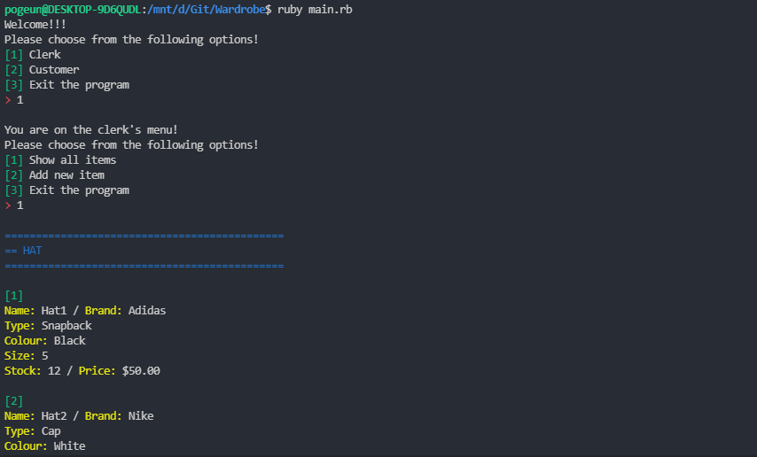

# Wardrobe
## Software Development Plan
### ※ Describe at a high level what the application will do
Wardrobe is the application that bascially has two different options.

One is for the "Clerk" of the clothes store where he/she can view the clothes those are available in the store, add and remove the clothes from their database. Currently it utilizes plain .txt files rather than real Database (DB) system.

On the other hand the application also supports the "Customer" mode which allows the customer to view all the clothes available in the store, add the item into the shopping cart and make a payment via credit card. The current system only allows the payment method of credit card, but it is possible to be extended to PayPal, direct debit, Afterpay, etc.

<hr />

### ※ Identify the problem it will solve and explain why you are developing it
The purpose of this application is to allow the store and clerk to easily manage the items available in the store and to reduce the time spent on them manually tracking each items.

On the customer's perspective, it is to ease them tracking their shopping cart and also to provide the fluent experience of the online shopping.

<hr />

### ※ Identify the target audience
The target audiences would be any clothing stores which are having difficulties on managing their stocks. The current system is focused on clothes, but this could be extended further in the future and could be used as a prototype for those who are willing to open their online store of any kinds.

<hr />

### ※ Explain how a member of the target audience will use it
The current system is built as a terminal application where the user gets prompted to choose their user type between "Clerk" and "Customer". If the user is not willing to proceed any further, they also get an option to quit the program.

Once the user chooses user type, they are prompted with several options where they can add, delete and view items to the database and also to the shopping cart.

Every time when the user types in invalid option or the input, the user will be informed an error that their option or input is not valid.

<hr />

### ※ Features and description

#### .txt based database
There are four different categories of clothes available for the current system and data for each categories are stored in separate .txt files to easily manage them and details include:
- name **(String)**
- brand **(String)**
- type **(String)**
- colour **(String)**
- size **(Integer)**
- stock **(Integer)**
- price **(Float)**

where each details are separated with "　" and each item is stored in each line.

The program will go through each item and create the object based on their type, the category. The created instance will then be stored into a hash called "clothes" where this hash is a class variable. That being said no matter how many Wardrobe instance gets created, this will be shared through the class.

This hash gets updated through the iteration of the program which gets stored into the each .txt files before the program gets terminated.

The current version of the application does not have a specific item ID for each clothes, but it is expected to be implemented for better item search, deletion and modification of the existing items.

```ruby
def retrive_data_from_files
  # loop through each files within database folder
  Dir.foreach(FILE_PATH) do |filename|
    # skip if filename is . or .. OR if the file is empty
    next if filename == '.' or filename == '..'
    next if File.empty?(FILE_PATH + filename)

    # get category from file name
    category = filename.gsub(".txt", "")
    
    # open file for data reading purpose only
    file = File.open(FILE_PATH + filename)

    # loop through each line and create clothes object based on their category
    file.each_line do |line|
      details = []
      line.chomp.split("　").each do |detail|
        key, value = detail.split(":")

        if key == "size" or key == "stock"
          value = value.to_i
        elsif key == "price"
          value = value.to_f
        end

        details << value
      end

      @@clothes[category.to_sym] << Object.const_get(category.capitalize).new(*details)
    end

    # close the file to free memory
    file.close
  end
end
```

#### Shopping cart
Shopping cart is an array of clothes which is stored in Wardrobe object as an instance variable. That said, the shopping cart is unique to each wardrobe object and thus the user can have their own shopping cart in theory.

Unlike the store database (@@clothes), shopping cart is a plain array as I thought it is unnecessary to separate items into different categories.

```ruby
# clothes objects hash
@@clothes = {
  :hat => [],
  :top => [],
  :pants => [],
  :shoes => []
}
```

<b>vs.</b>

```ruby
@@user_type = "customer"

# instance variable to store customer's shopping cart
@shopping_cart = []

menu_for_customer
```

#### Payment
The current version of the application only accepts the credit/debit card payments. The application will ask the customer to type in their card number, expiry month & year, card holder's name and CVC.
- card_number **(Integer)**
- expiry_month **(Integer)**
- expiry_year **(Integer)**
- card_holder **(String)**
- cvc **(Integer)**

Once the proper input has been made, the payment will be proceeded and this will deduct the stock from the database and shopping cart will be cleared.

```ruby
@shopping_cart.each do |item|
  @@clothes.each do |category, items|
    items.each do |target|
      target.stock -= 1 if target == item
    end
  end
end

@shopping_cart = []
```

Whenever, the customer enters invalid input (e.g. 15-digits for card number, 13 for month, etc.), the users would receive an error message saying that the input is invalid and thus retry with a proper values.

- Menu for clerk
  - **Show all items:** shows every items available in the store separated by categories.
    - **Delete item:** prompts the user to choose the category and item number to delete an item from database.
  - **Add new item:** creates the new clothes object and stores it into the hash
    - **Input item details:** prompts the user to type in name, brand, type, colour, size, stock and price of the new item then returns those data in array
  - **Exit program:** exits the program.
- Menu for customer
  - **Show all items:** shows every items available in the store separated by categories.
    - **Add item to shopping cart:** prompts the user to choose the category and item number to add an item into their shopping cart.
  - **Show shopping cart:** shows the list of items from the shopping cart.
    - **Remove item from shopping cart:** remove a selected item from the shopping cart
    - **Make a payment:** prompts the user to type in the card number, expiry month & year, cardholder's name and CVC, then proceed payment.
  - **Exit program:** exits the program.

<hr />

### ※ User interaction and experience

The application has user friendly menus that allows the both clerk and customer to easily navigate through the application and choose options.


